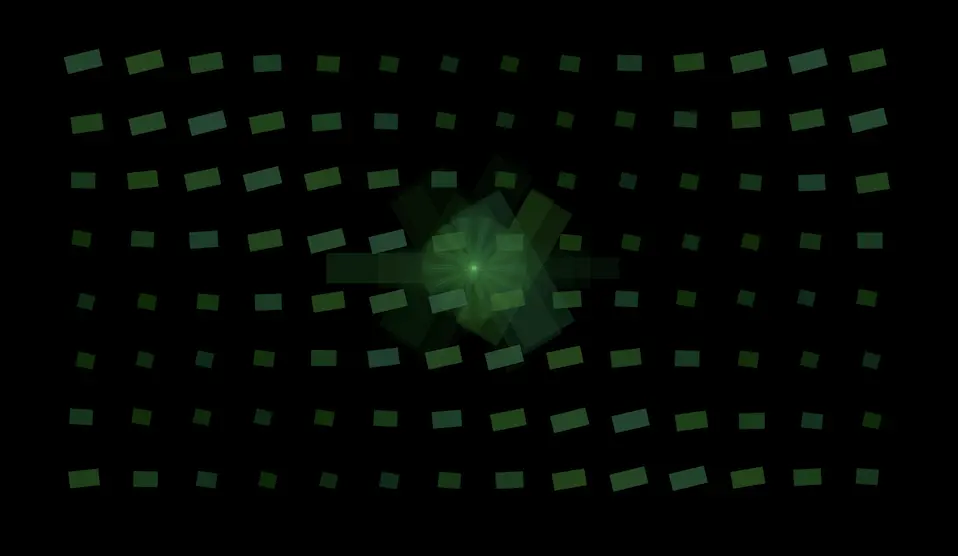
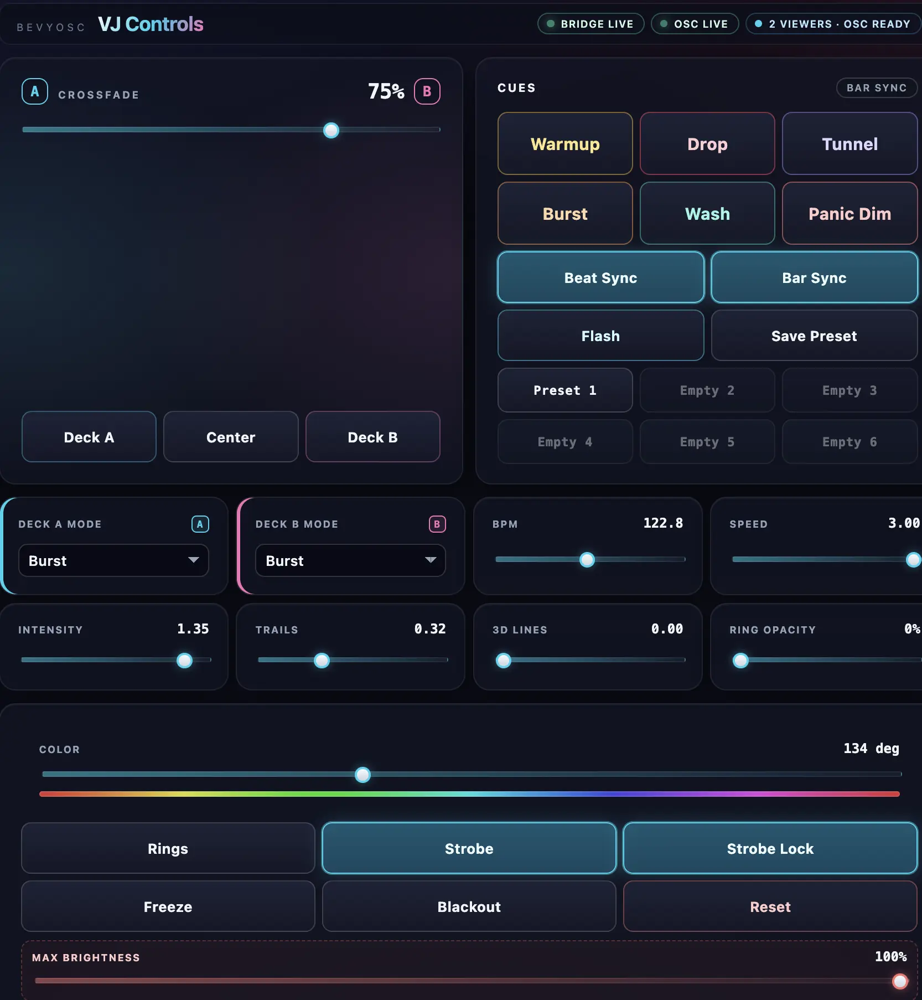

# aurora

Browser/WebAssembly Bevy app for live Video DJ performance. The first show build favors dependable procedural visuals, keyboard control, and a local Bun server over risky real-time browser video decoding.



## Requirements

- Rust with the `wasm32-unknown-unknown` target.
- [`wasm-bindgen-cli`](https://rustwasm.github.io/wasm-bindgen/reference/cli.html).
- Bun.
- A browser with WebGPU enabled, such as current Chrome or Edge.

Install the Rust pieces once. The `wasm-bindgen-cli` version must match the version locked by the Rust build:

```bash
rustup target add wasm32-unknown-unknown
cargo install -f wasm-bindgen-cli --version 0.2.122
```

Install Bun dependencies:

```bash
bun install
```

## Run

Build the WebAssembly bundle and serve it locally:

```bash
bun run build:web
bun run serve
```

Open the clean projector output at [http://localhost:3000](http://localhost:3000).
Open the separate controls app at [http://localhost:3001](http://localhost:3001).

Or build and serve in one step:

```bash
bun run dev
```

Quick type-checking without producing artifacts:

```bash
bun run check:wasm   # cargo check against wasm32-unknown-unknown
bun run check:vst    # cargo check the VST plugin crate
```

The shipped projector build is **`wasm32-unknown-unknown`** — use **`bun run check:wasm`** / **`bun run build:web`**, or **`cargo check-wasm`** / **`cargo build-wasm`** from **`.cargo/config.toml`**.

Because `bevy` is **`default-features = false`**, the crate also opts into **`x11`** so a host **`cargo check`** on GitHub/Linux still compiles (`winit` gets `x11`; WASM builds still use `winit`'s web backend). Don't set **`[build] target = "wasm32-unknown-unknown"`** in Cargo config: **`xtask`** must stay a host build.

## Performance Controls

Use the controls app on port `3001` for show operation. The projector output on port `3000` has no visible HUD or help overlay.



The controls app includes show-oriented controls:

- Cue buttons for Warmup, Drop, Tunnel, Burst, Wash, and Panic Dim.
- Beat-sync and bar-sync cue staging from Ableton beat data, with manual BPM as a fallback.
- Six local preset slots saved in the browser.
- Deck A/B visual mode selectors: Beams, Tunnel, Burst, Mirror, and Wash.
- Safety controls for max brightness, strobe lockout, blackout, freeze, and reset.
- Ableton track mapping for Deck A, Deck B, bass, mid, and high reactions.
- Demo Audio for rehearsal without Ableton.
- In-memory record/replay for rehearsing control moves during a session.
- Diagnostics for OSC, bridge, viewer count, and meter activity.

Keyboard shortcuts still work on the visual page if you need a fallback:

- `Left` / `Right`: move the crossfader.
- `A` / `S` / `D`: snap to deck A, center, or deck B.
- `Up` / `Down`: adjust BPM.
- `J` / `L`: adjust animation speed.
- `I` / `K`: adjust intensity.
- `Q` / `E`: change palette.
- `[` / `]`: adjust trails/feedback.
- `F`: flash.
- `T`: toggle strobe.
- `B`: toggle blackout.
- `Space`: freeze motion.
- `R`: reset to defaults.

## Ableton OSC Reactivity

The Bun server mirrors the OSC bridge pattern from `ableton-osc-visualizer`:

- Receives AbletonOSC replies on `LIVE_RECV_PORT` (`11001` by default).
- Sends subscription/poll requests to `LIVE_HOST:LIVE_SEND_PORT` (`127.0.0.1:11000` by default).
- Broadcasts tempo, beat, play state, and `track.output_meter_level` frames to the visual output and controls app over `/ws`.

Start Ableton with AbletonOSC listening on port `11000`, then run:

```bash
bun run build:web
bun run serve
```

The controls app shows `OSC live` plus energy bands, deck averages, server diagnostics, and mapped track activity when the bridge is receiving data. Use the Ableton Mapping panel to choose which 0-based track indices drive each visual signal. Override ports if needed:

```bash
LIVE_HOST=127.0.0.1 LIVE_SEND_PORT=11000 LIVE_RECV_PORT=11001 bun run serve
```

### Clock-source priority

The bridge can receive tempo from three places at once: an Ableton Link session
(`ABLETON_LINK_ENABLED=1`), an external MIDI clock (`MIDI_CLOCK_DEVICE=...`), and
the AbletonOSC tempo mirror. When two sources disagree they must not fight over
the tempo mirror, so the bridge arbitrates with a fixed priority:

**Ableton Link > MIDI clock > internal (AbletonOSC / default).**

Only the highest-priority *active* source drives the tempo mirror; lower-priority
sources stay silent while it is present. When a higher-priority source drops
(its updates stop arriving within the timeout window), the next one down takes
over with no gap — internal is always available as the floor. The arbitration
lives in `clock-arbiter.ts`.

## Ableton MIDI Control Surface Bridge

The repo includes a VST3 audio effect plugin at `plugins/aurora-vst`. Add it to an Ableton track, then use Ableton MIDI Map mode to map your MIDI controller knobs/buttons to the plugin parameters. The plugin sends parameter changes to the Bun bridge over local OSC on `VST_CONTROL_RECV_PORT` (`12000` by default), and the bridge rebroadcasts them to the controls page and projector.

Build and install the plugin on macOS:

```bash
bun run build:vst
bun run install:vst:mac
```

After installing, rescan plugins in Ableton and load `aurora VJ Bridge` as a VST3 audio effect. Start the VJ bridge with:

```bash
bun run build:web
bun run serve
```

If you need a different plugin control port, start the server with:

```bash
VST_CONTROL_RECV_PORT=12000 bun run serve
```

The plugin exposes continuous parameters for crossfade, BPM, speed, intensity, trails, depth, palette, ring opacity, and max brightness; toggle parameters for rings, strobe, strobe lockout, blackout, freeze, beat sync, bar sync, and demo mode; deck mode parameters for Beams/Tunnel/Burst/Mirror/Wash; and momentary parameters for flash, reset, and the cue presets.

## Layout

- `src/main.rs` – Bevy app compiled to WebAssembly.
- `bridge/index.ts` – Bun server hosting the projector page, the controls page, and the OSC/WebSocket bridge.
- `web/index.html` / `web/styles.css` – projector output (port `3000`).
- `web/controls.html` / `web/controls.css` – controls app (port `3001`).
- `plugins/aurora-vst/` – VST3 plugin that forwards parameter changes to the bridge over OSC.
- `assets/` – fonts, images, and reserved shaders.

## Notes

The visuals are generated in Bevy from CPU-fed material parameters so the app remains easy to debug before a live set. AbletonOSC meter levels drive pulse size, brightness, deck gain, mapped bass/mid/high motion, and beat flashes. `assets/shaders/vj_palette.wgsl` is reserved for a future GPU-material pass.
