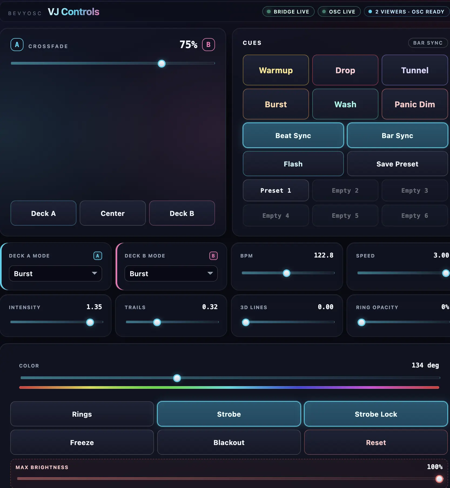

# aurora

> This is an experimental project I use for learning. It isn't perfect.

Browser/WebAssembly Bevy app for live Video DJ performance. The first show build favors dependable procedural visuals, keyboard control, and a local Bun server over risky real-time browser video decoding.

## Requirements

- Docker (Desktop or Engine) — `aurora` builds and runs the show stack as one container.
- A browser with WebGPU enabled, such as current Chrome or Edge.
- For local wasm/tooling work (tests, clippy): Rust `wasm32-unknown-unknown`, Bun, and [`wasm-bindgen-cli`](https://rustwasm.github.io/wasm-bindgen/reference/cli.html) **0.2.122**.

Install once (`bun run setup` also verifies wasm-bindgen and runs `bun link` so `aurora` is on your PATH):

```bash
bun run setup
# or: bun install && bun link
```

## Run

From the repo (Docker must be running):

```bash
aurora
```

That builds the image, starts the container, and streams logs. Ctrl+C stops and removes the container.

Native (no Docker) — vendors Caddy for your OS/arch and `Bun.spawn`s the bridge:

```bash
aurora --native    # or: aurora -n
```

Detach:

```bash
aurora -d          # docker detached
aurora -n -d       # native detached
aurora down        # stop docker and/or native
```

(`bun run aurora` / `bun run dev` are the same entrypoint. Compile a self-contained CLI that embeds the Docker build context with `bun run build:cli` → `./aurora`.)

Then open:

- Projector: [https://localhost:8443](https://localhost:8443)
- Controls: [https://localhost:8444](https://localhost:8444)
- Preset Studio: [https://localhost:8444/studio/](https://localhost:8444/studio/)
- Muxox service logs UI: [http://localhost:8450](http://localhost:8450)

Accept the Caddy `tls internal` certificate warning once.

### LAN / other devices

Use the same HTTPS ports on this machine’s LAN IP (`https://<ip>:8443` / `:8444`). WebGPU requires a secure context — plain `http://192.168.x.x` will black-screen the projector. The Docker image terminates TLS via Caddy so LAN clients get a secure context after trusting the warning.

AbletonOSC / VST UDP (`11001`, `12000`) is published from the container; the bridge reaches Ableton on the host via `host.docker.internal`. VST control is local OSC/UDP, not HTTP or TLS; the CLI publishes port `12000` on host loopback only.

### Pages deployment: pairing over the relay

The GitHub Pages build has no bridge and no LAN certificate to trust, so a phone
reaches the projector through a Cloudflare Worker instead
(`worker/`, deployed at `https://aurora-relay.seemueller.workers.dev`).

1. Open the Pages **projector** on the machine that renders. It registers a
   session (silently — nothing is drawn over the show image).
2. In **Console**, press **Pair phone** in the top row to reveal an 8-character
   code.
3. Open the Pages **mobile client** on a phone and type the code.

Pairing lives in Console rather than on the projector because it is an ops
action: a code painted on the canvas competes with the artwork and stays in
every capture and IMAG feed. Console only reveals it when asked, so there is no
code sitting on a screen for the room to read. Projector and Console share the
session through same-origin storage, so whichever you open first registers it
and the other adopts it — and Console shows **Phone paired** once a guest is
actually live. That signal is per-browser: a Console driven from a *different*
machine than the projector will keep showing the code as unpaired.

For a projector-only setup with no Console open, `?pairOverlay=1` puts the old
on-canvas panel back.

Both ends load over a public CA, so there is no certificate warning anywhere —
the reason this path exists at all. The code is redeemed **once** for a random
token and is then useless; it expires after five minutes, and Console's
“New code” button issues a fresh one. Session identity is never derived from
anything device-shaped: a fingerprint would be guessable by anyone with a
similar device, and would break on a browser update.

The relay brokers opaque frames — it authenticates sockets and forwards bytes
without parsing control state, so the show schema can change without the Worker
knowing or being redeployed. Expect ~65 ms of added latency versus ~1 ms on the
LAN; parameter moves feel fine and cue quantization happens on the receiving
side, but a local bridge is still the better path when you have one.

```bash
bun run worker:dev      # local wrangler dev
bun run worker:deploy   # publish
bun run typecheck:worker
```

Point either surface at a different relay with `?relay=https://…` (persisted).

### Mobile show client

`https://<ip>:8444/mobile/` is a touch-first control surface for running a show
from a phone (the CLI prints this as the `phone` link). Three tabs — Mix
(crossfade, deck packs, intensity), Cues (cue pads, preset recall), Params
(masters) — with blackout / freeze / strobe / flash pinned above the tab bar so
they are never behind a tab switch. Setup takes the mic as an audio source, so a
phone can drive tempo and energy with no Ableton and no OSC.

It is a *view* over the same `ControlsProvider` the console uses, not a second
client: transport, reconnect, clamping, cue quantization, and preset
interpolation are shared, so the two surfaces cannot drift. Preset save/rename
and the deeper mapping panels stay on the console.

### Driving a remote instance (phone as control surface)

Both the console and the mobile client can drive a bridge other than the one
that served them. Settings → **Instance** takes a bridge address
(`192.168.1.10:8444`; bare hosts get `https://`) and an optional access token,
then reloads. `?instance=…&token=…` on the URL does the same in one tap, so the
LAN links the CLI prints can be shared or QR-encoded straight to a phone.

Two things to know before load-in:

- **Certificate trust is per device.** Caddy's `tls internal` is a private CA,
  and you cannot click through a warning for a `wss://` subresource — open the
  bridge address in a tab once and accept it *before* connecting the console.
- **Same-origin is simpler.** A console served *by* the instance it drives needs
  no CORS and one cert acceptance. Cross-origin works (the bridge answers
  preflights on `/api/*`) but is the harder path.

The bridge binds `0.0.0.0`, so by default anyone who can reach the port can drive
the show. Set a token to gate it:

```bash
AURORA_ACCESS_TOKEN=$(openssl rand -hex 16) aurora
```

That gates the `/ws` control bus and package import; read-only mode-catalog GETs
stay open. The CLI prints tokenized LAN links, and the projector picks the token
up from its own URL. Without the env var, behaviour is unchanged and the CLI
warns you the instance is open.

#### Pairing a phone with a one-time code

Reading a 32-character hex token out to someone holding a phone does not work,
so in practice it gets shared as a tokenised URL — which puts the *long-lived*
credential through a chat app. Issue a short code instead:

1. **Console → Settings → Phone pairing → Issue pairing code.** Eight characters,
   same alphabet and five-minute life as the relay's pairing code.
2. On the phone, **Setup → Pairing code**, type it, **Pair with code**.

The code is redeemed **once** for a random session token, which the phone stores
as its instance token — so it reconnects on its own afterwards without the code
or the access token. Wrong guesses are limited (five well-formed attempts burn
the code; the endpoint is flood-limited independently), compares are
constant-time, and no device fingerprinting is involved.

Sessions last 12 hours, end when the bridge restarts, and can be dropped
immediately with **Revoke phone sessions**. The instance must actually be gated —
`AURORA_ACCESS_TOKEN` is what authorises issuing a code, and an open bridge
refuses rather than hand out a credential that gates nothing.

### SoundCloud account in Console

The Console can connect a SoundCloud account and browse **Likes**, **My tracks**,
and recent tracks from **Following**, then play a selection in SoundCloud's
official embedded player. OAuth tokens stay off the static frontend.

For a local Console, register the exact public Console callback URL and start
Aurora with the credentials:

```bash
SOUNDCLOUD_CLIENT_ID=... \
SOUNDCLOUD_CLIENT_SECRET=... \
SOUNDCLOUD_REDIRECT_URI=https://localhost:8444/api/soundcloud/callback \
aurora
```

The client secret is passed into the container as an environment variable and
is never sent to the browser. When `AURORA_DATA_DIR` is available, the bridge
persists the refresh-token session in `soundcloud-session.json` with owner-only
permissions so the account remains connected across restarts. Disconnecting in
Console removes that session.

GitHub Pages uses the `aurora-relay` Cloudflare Worker instead: its
`SoundCloudAccount` Durable Object owns OAuth state, refresh-token rotation, and
the private Console bearer session. See [docs/soundcloud-worker.md](docs/soundcloud-worker.md)
for one-time Worker secrets, the SoundCloud redirect URI, and the Pages repository
variable.

### Image

Runtime image: **`ghcr.io/geoffsee/aurora:latest`**. One process tree: [muxox](https://github.com/geoffsee/muxox) supervises Caddy + the Bun bridge (`deploy/muxox.toml`). CI pushes `:latest` on `main` and `:vX.Y.Z` on release tags (see `.github/workflows/publish-image.yml`). Operators who only want the published image can `docker pull` / `docker run` it themselves; `aurora` is the repo-side build-and-run path.

Version tags also publish cross-compiled CLI binaries (macOS / Linux / Windows × x64 & arm64) via `.github/workflows/release-cli.yml` — download from the GitHub Release, run with Docker installed; no repo checkout required.

### Tooling without Docker

Quick type-checking and tests (no container):

```bash
bun run check:wasm   # cargo check against wasm32-unknown-unknown
bun run check:vst    # cargo check the VST plugin crate
bun run test
```

The shipped projector build is **`wasm32-unknown-unknown`** — use **`bun run check:wasm`** / **`bun run build:web`**, or **`cargo check-wasm`** / **`cargo build-wasm`** from **`.cargo/config.toml`**.

Because `bevy` is **`default-features = false`**, the crate also opts into **`x11`** so a host **`cargo check`** on GitHub/Linux still compiles (`winit` gets `x11`; WASM builds still use `winit`'s web backend). Don't set **`[build] target = "wasm32-unknown-unknown"`** in Cargo config: **`xtask`** must stay a host build.

## Performance Controls

Use the controls app on port `8444` for show operation. The projector output on port `8443` has no visible HUD or help overlay.



The controls app includes show-oriented controls:

- Cue buttons for Warmup, Drop, Tunnel, Burst, Wash, and Panic Dim.
- Beat-sync and bar-sync cue staging from Ableton beat data, with manual BPM as a fallback.
- Six local preset slots saved in the browser.
- Deck A/B visual mode selectors: Beams, Tunnel, Burst, Mirror, and Wash.
- Safety controls for max brightness, strobe lockout, blackout, freeze, and reset.
- Ableton track mapping for Deck A, Deck B, bass, mid, and high reactions.
- Demo Audio for rehearsal without Ableton.
- In-memory record/replay for rehearsing control moves during a session.
- Diagnostics for OSC, bridge, viewer count, and meter activity.

Keyboard shortcuts still work on the visual page if you need a fallback:

- `Left` / `Right`: move the crossfader.
- `A` / `S` / `D`: snap to deck A, center, or deck B.
- `Up` / `Down`: adjust BPM.
- `J` / `L`: adjust animation speed.
- `I` / `K`: adjust intensity.
- `Q` / `E`: change palette.
- `[` / `]`: adjust trails/feedback.
- `F`: flash.
- `T`: toggle strobe.
- `B`: toggle blackout.
- `Space`: freeze motion.
- `R`: reset to defaults.

## Ableton OSC Reactivity

The Bun server mirrors the OSC bridge pattern from `ableton-osc-visualizer`:

- Receives AbletonOSC replies on `LIVE_RECV_PORT` (`11001` by default).
- Sends subscription/poll requests to `LIVE_HOST:LIVE_SEND_PORT` (`127.0.0.1:11000` by default).
- Broadcasts tempo, beat, play state, and `track.output_meter_level` frames to the visual output and controls app over `/ws`.

Start Ableton with AbletonOSC listening on port `11000`, then run:

```bash
aurora
```

The controls app shows `OSC live` plus energy bands, deck averages, server diagnostics, and mapped track activity when the bridge is receiving data. Use the Ableton Mapping panel to choose which 0-based track indices drive each visual signal. Override ports if needed:

```bash
LIVE_HOST=127.0.0.1 LIVE_SEND_PORT=11000 LIVE_RECV_PORT=11001 aurora
```

### Clock-source priority

The bridge can receive tempo from three places at once: an Ableton Link session
(`ABLETON_LINK_ENABLED=1`), an external MIDI clock (`MIDI_CLOCK_DEVICE=...`), and
the AbletonOSC tempo mirror. When two sources disagree they must not fight over
the tempo mirror, so the bridge arbitrates with a fixed priority:

**Ableton Link > MIDI clock > internal (AbletonOSC / default).**

Only the highest-priority *active* source drives the tempo mirror; lower-priority
sources stay silent while it is present. When a higher-priority source drops
(its updates stop arriving within the timeout window), the next one down takes
over with no gap — internal is always available as the floor. The arbitration
lives in `clock-arbiter.ts`.

## Ableton MIDI Control Surface Bridge

The repo includes a VST3 audio effect plugin at `plugins/aurora-vst`. Add it to an Ableton track, then use Ableton MIDI Map mode to map your MIDI controller knobs/buttons to the plugin parameters. The plugin sends parameter changes to the Bun bridge over local OSC on `VST_CONTROL_RECV_PORT` (`12000` by default), and the bridge rebroadcasts them to the controls page and projector.

Build and install the plugin on macOS:

```bash
bun run build:vst
bun run install:vst:mac
```

After installing, rescan plugins in Ableton and load `aurora VJ Bridge` as a VST3 audio effect. Start the VJ bridge with:

```bash
aurora
```

If you need a different plugin control port, start with:

```bash
AURORA_VST_TARGET=127.0.0.1:12001 VST_CONTROL_RECV_PORT=12001 aurora
```

Set `AURORA_VST_TARGET` in the environment that launches Ableton so the plugin and bridge use the same non-default port.

The plugin exposes continuous parameters for crossfade, BPM, speed, intensity, trails, depth, palette, ring opacity, and max brightness; toggle parameters for rings, strobe, strobe lockout, blackout, freeze, beat sync, bar sync, and demo mode; deck mode parameters for Beams/Tunnel/Burst/Mirror/Wash; and momentary parameters for flash, reset, and the cue presets.

## Mode packs (filesystem catalog)

Visualization packs live under `data/decks/` (bundled) with an optional
`AURORA_DATA_DIR` overlay. Packs are **params + shaders + meshes** on registered
field primitives — novel field math needs an engine PR. See:

- [`data/README.md`](data/README.md) — layout, overlay, slug/atomic-replace rules, operator reload/fallback, static vs bridged
- [`docs/mode-protocol.md`](docs/mode-protocol.md) — authoring vs wire vs engine version axes
- [`docs/mode-primitives.md`](docs/mode-primitives.md) — permanent primitive IDs, param table, product ceiling

```bash
# Native
AURORA_DATA_DIR=./my-modes aurora --native
aurora --native --data-dir ./my-modes

# Docker (CLI mounts the path and sets AURORA_DATA_DIR inside the container)
AURORA_DATA_DIR=./my-modes aurora
aurora --data-dir ./my-modes

# Offline validate (no bridge / WASM)
bun run modes:validate              # scan ./data
bun run modes:validate ./my-modes   # overlay root with decks/deck-a|deck-b
```

Override entries **shadow by slug only** (full folder replace, not JSON deep-merge).
Missing or empty override still serves the full bundled catalog — there is **no**
first-run copy of bundled → override. See [`data/README.md`](data/README.md).

## Layout

- `src/main.rs` – Bevy app compiled to WebAssembly.
- `bridge/index.ts` – Bun server hosting the projector page, the controls page, and the OSC/WebSocket bridge.
- `bridge/mode-catalog.ts` – data-dir resolve, deck scan, overlay merge, catalog epoch.
- `data/decks/` – bundled per-deck preset folders (`preset.json` + assets).
- `web/index.html` / `web/styles.css` – projector output (port `8443` via Caddy).
- `web/controls/` – controls app (port `8444` via Caddy).
- `data/` – bundled deck preset catalog + authoring guide (`data/README.md`).
- `docs/mode-protocol.md` / `docs/mode-primitives.md` – mode pack protocol and primitive ceiling.
- `deploy/` – `Caddyfile` + `muxox.toml` for the container entrypoint.
- `Dockerfile` – `ghcr.io/geoffsee/aurora` image (muxox + Caddy + Bun).
- `plugins/aurora-vst/` – VST3 plugin that forwards parameter changes to the bridge over OSC.
- `assets/shaders/` – reserved / generated WGSL.

## Notes

The visuals are generated in Bevy from CPU-fed material parameters so the app remains easy to debug before a live set. AbletonOSC meter levels drive pulse size, brightness, deck gain, mapped bass/mid/high motion, and beat flashes. `assets/shaders/vj_palette.wgsl` is reserved for a future GPU-material pass.
