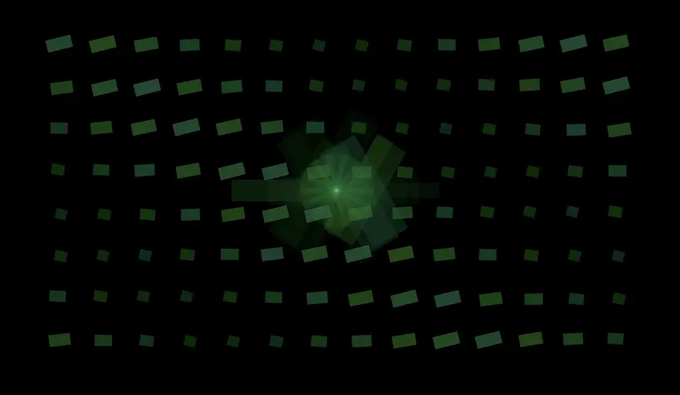

# aurora

Browser/WebAssembly Bevy app for live Video DJ performance. The first show build favors dependable procedural visuals, keyboard control, and a local Bun server over risky real-time browser video decoding.



## Requirements

- Docker (Desktop or Engine) — `aurora` builds and runs the show stack as one container.
- A browser with WebGPU enabled, such as current Chrome or Edge.
- For local wasm/tooling work (tests, clippy): Rust `wasm32-unknown-unknown`, Bun, and [`wasm-bindgen-cli`](https://rustwasm.github.io/wasm-bindgen/reference/cli.html) **0.2.122**.

Install once (`bun run setup` also verifies wasm-bindgen and runs `bun link` so `aurora` is on your PATH):

```bash
bun run setup
# or: bun install && bun link
```

## Run

From the repo (Docker must be running):

```bash
aurora
```

That builds the image, starts the container, and streams logs. Ctrl+C stops and removes the container.

Native (no Docker) — vendors Caddy for your OS/arch and `Bun.spawn`s the bridge:

```bash
aurora --native    # or: aurora -n
```

Detach:

```bash
aurora -d          # docker detached
aurora -n -d       # native detached
aurora down        # stop docker and/or native
```

(`bun run aurora` / `bun run dev` are the same entrypoint. Compile a self-contained CLI that embeds the Docker build context with `bun run build:cli` → `./aurora`.)

Then open:

- Projector: [https://localhost:8443](https://localhost:8443)
- Controls: [https://localhost:8444](https://localhost:8444)
- Muxox service logs UI: [http://localhost:8450](http://localhost:8450)

Accept the Caddy `tls internal` certificate warning once.

### LAN / other devices

Use the same HTTPS ports on this machine’s LAN IP (`https://<ip>:8443` / `:8444`). WebGPU requires a secure context — plain `http://192.168.x.x` will black-screen the projector. The Docker image terminates TLS via Caddy so LAN clients get a secure context after trusting the warning.

AbletonOSC / VST UDP (`11001`, `12000`) is published from the container; the bridge reaches Ableton on the host via `host.docker.internal`.

### Image

Runtime image: **`ghcr.io/geoffsee/aurora:latest`**. One process tree: [muxox](https://github.com/geoffsee/muxox) supervises Caddy + the Bun bridge (`deploy/muxox.toml`). CI pushes `:latest` on `main` and `:vX.Y.Z` on release tags (see `.github/workflows/publish-image.yml`). Operators who only want the published image can `docker pull` / `docker run` it themselves; `aurora` is the repo-side build-and-run path.

Version tags also publish cross-compiled CLI binaries (macOS / Linux / Windows × x64 & arm64) via `.github/workflows/release-cli.yml` — download from the GitHub Release, run with Docker installed; no repo checkout required.

### Tooling without Docker

Quick type-checking and tests (no container):

```bash
bun run check:wasm   # cargo check against wasm32-unknown-unknown
bun run check:vst    # cargo check the VST plugin crate
bun run test
```

The shipped projector build is **`wasm32-unknown-unknown`** — use **`bun run check:wasm`** / **`bun run build:web`**, or **`cargo check-wasm`** / **`cargo build-wasm`** from **`.cargo/config.toml`**.

Because `bevy` is **`default-features = false`**, the crate also opts into **`x11`** so a host **`cargo check`** on GitHub/Linux still compiles (`winit` gets `x11`; WASM builds still use `winit`'s web backend). Don't set **`[build] target = "wasm32-unknown-unknown"`** in Cargo config: **`xtask`** must stay a host build.

## Performance Controls

Use the controls app on port `8444` for show operation. The projector output on port `8443` has no visible HUD or help overlay.


The controls app includes show-oriented controls:

- Cue buttons for Warmup, Drop, Tunnel, Burst, Wash, and Panic Dim.
- Beat-sync and bar-sync cue staging from Ableton beat data, with manual BPM as a fallback.
- Six local preset slots saved in the browser.
- Deck A/B visual mode selectors: Beams, Tunnel, Burst, Mirror, and Wash.
- Safety controls for max brightness, strobe lockout, blackout, freeze, and reset.
- Ableton track mapping for Deck A, Deck B, bass, mid, and high reactions.
- Demo Audio for rehearsal without Ableton.
- In-memory record/replay for rehearsing control moves during a session.
- Diagnostics for OSC, bridge, viewer count, and meter activity.

Keyboard shortcuts still work on the visual page if you need a fallback:

- `Left` / `Right`: move the crossfader.
- `A` / `S` / `D`: snap to deck A, center, or deck B.
- `Up` / `Down`: adjust BPM.
- `J` / `L`: adjust animation speed.
- `I` / `K`: adjust intensity.
- `Q` / `E`: change palette.
- `[` / `]`: adjust trails/feedback.
- `F`: flash.
- `T`: toggle strobe.
- `B`: toggle blackout.
- `Space`: freeze motion.
- `R`: reset to defaults.

## Ableton OSC Reactivity

The Bun server mirrors the OSC bridge pattern from `ableton-osc-visualizer`:

- Receives AbletonOSC replies on `LIVE_RECV_PORT` (`11001` by default).
- Sends subscription/poll requests to `LIVE_HOST:LIVE_SEND_PORT` (`127.0.0.1:11000` by default).
- Broadcasts tempo, beat, play state, and `track.output_meter_level` frames to the visual output and controls app over `/ws`.

Start Ableton with AbletonOSC listening on port `11000`, then run:

```bash
aurora
```

The controls app shows `OSC live` plus energy bands, deck averages, server diagnostics, and mapped track activity when the bridge is receiving data. Use the Ableton Mapping panel to choose which 0-based track indices drive each visual signal. Override ports if needed:

```bash
LIVE_HOST=127.0.0.1 LIVE_SEND_PORT=11000 LIVE_RECV_PORT=11001 aurora
```

### Clock-source priority

The bridge can receive tempo from three places at once: an Ableton Link session
(`ABLETON_LINK_ENABLED=1`), an external MIDI clock (`MIDI_CLOCK_DEVICE=...`), and
the AbletonOSC tempo mirror. When two sources disagree they must not fight over
the tempo mirror, so the bridge arbitrates with a fixed priority:

**Ableton Link > MIDI clock > internal (AbletonOSC / default).**

Only the highest-priority *active* source drives the tempo mirror; lower-priority
sources stay silent while it is present. When a higher-priority source drops
(its updates stop arriving within the timeout window), the next one down takes
over with no gap — internal is always available as the floor. The arbitration
lives in `clock-arbiter.ts`.

## Ableton MIDI Control Surface Bridge

The repo includes a VST3 audio effect plugin at `plugins/aurora-vst`. Add it to an Ableton track, then use Ableton MIDI Map mode to map your MIDI controller knobs/buttons to the plugin parameters. The plugin sends parameter changes to the Bun bridge over local OSC on `VST_CONTROL_RECV_PORT` (`12000` by default), and the bridge rebroadcasts them to the controls page and projector.

Build and install the plugin on macOS:

```bash
bun run build:vst
bun run install:vst:mac
```

After installing, rescan plugins in Ableton and load `aurora VJ Bridge` as a VST3 audio effect. Start the VJ bridge with:

```bash
aurora
```

If you need a different plugin control port, start with:

```bash
VST_CONTROL_RECV_PORT=12000 aurora
```

The plugin exposes continuous parameters for crossfade, BPM, speed, intensity, trails, depth, palette, ring opacity, and max brightness; toggle parameters for rings, strobe, strobe lockout, blackout, freeze, beat sync, bar sync, and demo mode; deck mode parameters for Beams/Tunnel/Burst/Mirror/Wash; and momentary parameters for flash, reset, and the cue presets.

## Mode packs (filesystem catalog)

Visualization packs live under `data/decks/` (bundled) with an optional
`AURORA_DATA_DIR` overlay. Packs are **params + shaders + meshes** on registered
field primitives — novel field math needs an engine PR. See:

- [`data/README.md`](data/README.md) — layout, overlay, slug/atomic-replace rules, operator reload/fallback, static vs bridged
- [`docs/mode-protocol.md`](docs/mode-protocol.md) — authoring vs wire vs engine version axes
- [`docs/mode-primitives.md`](docs/mode-primitives.md) — permanent primitive IDs, param table, product ceiling

Validate packs offline (no bridge / WASM):

```bash
bun run modes:validate              # scan ./data
bun run modes:validate ./my-modes   # overlay root with decks/deck-a|deck-b
```

## Layout

- `src/main.rs` – Bevy app compiled to WebAssembly.
- `bridge/index.ts` – Bun server hosting the projector page, the controls page, and the OSC/WebSocket bridge.
- `web/index.html` / `web/styles.css` – projector output (port `8443` via Caddy).
- `web/controls/` – controls app (port `8444` via Caddy).
- `data/` – bundled deck preset catalog + authoring guide (`data/README.md`).
- `docs/mode-protocol.md` / `docs/mode-primitives.md` – mode pack protocol and primitive ceiling.
- `deploy/` – `Caddyfile` + `muxox.toml` for the container entrypoint.
- `Dockerfile` – `ghcr.io/geoffsee/aurora` image (muxox + Caddy + Bun).
- `plugins/aurora-vst/` – VST3 plugin that forwards parameter changes to the bridge over OSC.
- `assets/shaders/` – reserved / generated WGSL.

## Notes

The visuals are generated in Bevy from CPU-fed material parameters so the app remains easy to debug before a live set. AbletonOSC meter levels drive pulse size, brightness, deck gain, mapped bass/mid/high motion, and beat flashes. `assets/shaders/vj_palette.wgsl` is reserved for a future GPU-material pass.
